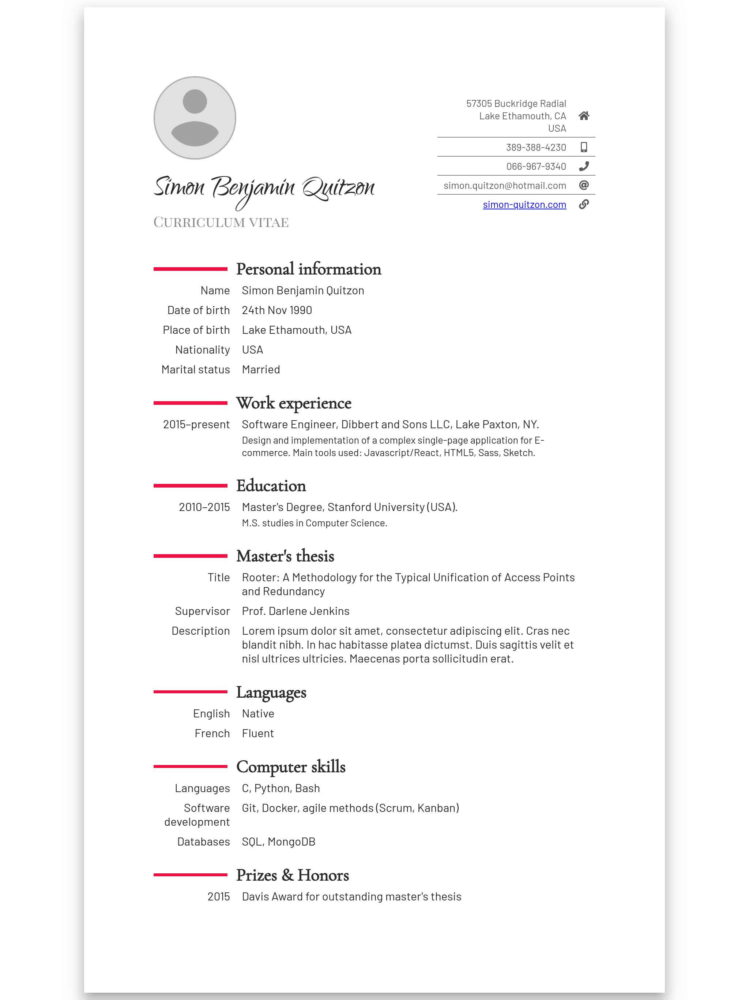

# cv-template

> My curriculum vitae template

See an example here: http://mhyfritz.com/cv-template/

## Project setup

```
npm install
```

### Compiles and hot-reloads for development

```
npm run serve
```

### Compiles and minifies for production

```
npm run build
```



## Attributions

- Design inspired by [`moderncv`](https://github.com/xdanaux/moderncv) (classic theme)
- Profile image placeholder from the [Chromium project](https://github.com/chromium/chromium)
- Fake data from [faker.js](https://github.com/marak/Faker.js/)
  and [SCIgen](https://pdos.csail.mit.edu/archive/scigen/)
